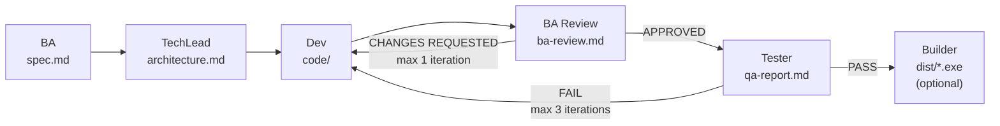

# dev-team

A Claude Code plugin that turns a one-line task description into a fully specified, implemented, reviewed, and tested project — with an optional `.exe` build at the end.

Six specialised subagents run as a pipeline, each producing disk artifacts that the next stage consumes. Review stages can send work **back to the Developer** when a previous stage did not meet the spec:



### Gates

| Gate | Possible verdicts | Action on failure |
|---|---|---|
| Any stage | `BLOCKED` | Pipeline stops, user is asked for input |
| BA Review (Stage 3) | `APPROVED` / `CHANGES REQUESTED` | Dev fix pass + BA Review re-run (max 1 iteration) |
| Tester (Stage 4) | `PASS` / `FAIL` | Dev fix pass + Tester re-run (max 3 iterations) |
| Builder (Stage 5, optional) | `OK` / `FAILED` | Reported to user, no auto-retry |

## Install

### Via marketplace (recommended)

```
/plugin marketplace add dgelios/dev-team
/plugin install dev-team@dgelios
```

### Via git clone (manual)

Clone this repo and copy its contents into `~/.claude/plugins/cache/dgelios/dev-team/`, then add the plugin to `~/.claude/plugins/installed_plugins.json`.

## Usage

### Create a new project

```
/dev-team:dev-team [--project <slug>] <task description>
```

Without `--project`, the folder slug is derived from the first meaningful words of the task (e.g. `Build Passgen CLI With 3 Flags` → `build-passgen-cli-3`).

```
/dev-team:dev-team implement a CSV parser that validates headers
/dev-team:dev-team --project csvtool implement a CSV parser that validates headers
/dev-team:dev-team build a tkinter GUI for managing todo items and package as .exe
```

The initial run always produces **v1.0.0** of the project.

### Improve an existing project

```
/dev-team:improve <project-slug> [--from <vX.Y.Z>] [--bump patch|minor|major] <improvement description>
```

- `--from` picks the base version (default: latest).
- `--bump` forces a specific semver step (default: derived from BA classification).

```
/dev-team:improve csvtool add --strict flag that fails on unknown columns
/dev-team:improve csvtool --bump patch fix off-by-one in header parser
/dev-team:improve csvtool --from v1.0.0 --bump minor experimental ndjson output
```

The Business Analyst classifies every improvement as `bug-fix`, `doc-update`, `optimization`, `feature-add`, `refactor`, or `breaking`, which drives the semver step **and** which stages run.

### Stage selection per classification

| Classification | Semver step | Stages executed |
|---|---|---|
| `bug-fix` | patch | Dev → BA Review → Tester |
| `doc-update` | patch | Dev |
| `optimization` | patch | Tech Lead → Dev → BA Review → Tester |
| `feature-add` | minor | Tech Lead → Dev → BA Review → Tester → Builder\* |
| `refactor` | minor | Tech Lead → Dev → BA Review → Tester |
| `breaking` | major | Tech Lead → Dev → BA Review → Tester → Builder\* |

`Builder*` runs only if the spec signals a GUI library or `.exe` keyword.

## Artifacts

All state lives under `.dev-team/` inside the current workspace:

```
.dev-team/
├── memory/                                  ← lessons learned across all projects (auto-seeded on first run)
│   ├── ba-memory.md
│   ├── techlead-memory.md
│   ├── dev-memory.md
│   ├── ba-review-memory.md
│   ├── tester-memory.md
│   └── builder-memory.md
└── projects/
    └── csvtool/                             ← one folder per project (slug, no timestamp)
        ├── v1.0.0/                          ← initial release
        │   ├── task.md
        │   ├── bump_type.txt                ← "initial"
        │   ├── spec/spec.md
        │   ├── code/
        │   ├── tests/
        │   ├── build/                       ← only if Builder ran
        │   └── results/
        │       ├── classification.txt       ← "initial"
        │       ├── architecture.md
        │       ├── dev-summary.md, dev-files.json
        │       ├── ba-review.md
        │       ├── qa-report.md, qa-files.json
        │       └── test-results.md
        ├── v1.0.1/                          ← bug fix
        │   ├── task.md                      ← the improvement description
        │   ├── parent_version.txt           ← "v1.0.0"
        │   ├── bump_type.txt                ← "patch"
        │   ├── spec/spec.md                 ← full amended spec (not a diff)
        │   ├── code/                        ← starts as a copy of v1.0.0, edited in place
        │   ├── tests/                       ← starts as a copy of v1.0.0, extended
        │   └── results/
        ├── v1.1.0/                          ← feature add
        └── v2.0.0/                          ← breaking change
```

Each version folder is a self-contained snapshot: `spec/`, `code/`, `tests/`, and `results/` are all final for that version. Parent versions are never modified once a newer version exists.

The filesystem layout is produced and validated by `scripts/project_init.py`. The orchestrator invokes that script rather than creating directories directly, so the shape stays consistent.

## How the pipeline works

| Stage | Agent | Output | Gate |
|---|---|---|---|
| 1 | `dev-team-ba` | `spec/spec.md` | STATUS=BLOCKED → stop |
| 1.5 | `dev-team-techlead` | `results/architecture.md` | STATUS=BLOCKED → stop |
| 2 | `dev-team-dev` | `code/`, `results/dev-summary.md`, `results/dev-files.json` | STATUS=BLOCKED → stop |
| 3 | `dev-team-ba-review` | `results/ba-review.md` | CHANGES REQUESTED → 1 dev fix pass, then re-review |
| 4 | `dev-team-tester` | `tests/`, `results/qa-report.md`, `results/test-results.md` | FAIL → up to 3 dev fix passes |
| 5 | `dev-team-builder` | `build/dist/*.exe` | optional, runs only when spec signals GUI/`.exe` |

Each agent reads a per-role memory file at the start and appends one dated lesson on success.

## Memory

On first run in a workspace, the plugin auto-seeds `.dev-team/memory/` with empty templates so subagents can start appending lessons. Memory is **workspace-local** — project-specific lessons stay where they were learned.

## Dependencies

- **Python 3.10+** — needed whenever the pipeline generates Python code
- **PyInstaller** — only for the optional Builder stage (`pip install pyinstaller`)

## Updating

### Auto-update (recommended)

Once the plugin is installed, open `~/.claude/settings.json` and enable auto-update for the `dgelios` marketplace:

```json
{
  "extraKnownMarketplaces": {
    "dgelios": {
      "autoUpdate": true
    }
  }
}
```

Claude Code will then check this marketplace on every start and pull the newest `version` from `plugin.json` when one is available. After an update you will be asked to run `/reload-plugins` to activate the new code.

### Manual update

```
/plugin marketplace update dgelios
/plugin update dev-team@dgelios
```

### Check installed version

```
/plugin list
```

The latest release is at https://github.com/dgelios/dev-team/releases/latest.

## Releasing (for maintainers)

There are two release flows — pick whichever fits the situation.

### Flow A: automatic on PR merge (default)

Merge any PR into `main` and `.github/workflows/auto-release.yml` will bump the version, tag, push, and publish a GitHub Release automatically.

- **Default bump: `patch`** (e.g. 1.0.4 → 1.0.5)
- Override with a **PR label** before merging:
  - `release:minor` → 1.0.5 → 1.1.0
  - `release:major` → 1.0.5 → 2.0.0
  - `release:skip` → merge without creating a release
- The workflow can also be triggered from the Actions tab with a specific bump via **Run workflow**.

Release notes are built from every commit between the previous tag and the new one, so writing clear commit messages (e.g. `feat: add abort command`, `fix: handle empty spec`) is all that is needed.

### Flow B: manual from your local machine

Useful when you want to release without going through a PR (e.g. quick docs-only release, or re-releasing from a tag).

```powershell
pwsh scripts/release.ps1 -Bump patch   # or -Bump minor / -Bump major / -Version X.Y.Z
```

The script bumps `.claude-plugin/plugin.json`, commits, tags `vX.Y.Z`, and pushes. `.github/workflows/release.yml` picks up the tag and publishes the GitHub Release.

Use `-DryRun` to preview the version bump and the commit list without touching anything.

## License

MIT
