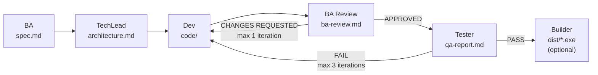

# dev-team

A Claude Code plugin that turns a one-line task description into a fully specified, implemented, reviewed, and tested project — with an optional `.exe` build at the end.

Six specialised subagents run as a pipeline, each producing disk artifacts that the next stage consumes. Review stages can send work **back to the Developer** when a previous stage did not meet the spec:



### Gates

| Gate | Possible verdicts | Action on failure |
|---|---|---|
| Any stage | `BLOCKED` | Pipeline stops, user is asked for input |
| BA Review (Stage 3) | `APPROVED` / `CHANGES REQUESTED` | Dev fix pass + BA Review re-run (max 1 iteration) |
| Tester (Stage 4) | `PASS` / `FAIL` | Dev fix pass + Tester re-run (max 3 iterations) |
| Builder (Stage 5, optional) | `OK` / `FAILED` | Reported to user, no auto-retry |

## Install

### Via marketplace (recommended)

```
/plugin marketplace add dgelios/dev-team
/plugin install dev-team@dgelios
```

### Via git clone (manual)

Clone this repo and copy its contents into `~/.claude/plugins/cache/dgelios/dev-team/`, then add the plugin to `~/.claude/plugins/installed_plugins.json`.

## Usage

From any project workspace:

```
/dev-team <task description>
```

Examples:

```
/dev-team implement a CSV parser that validates headers
/dev-team add feature: export results to JSON
/dev-team fix bug: login fails when email contains a plus sign
/dev-team build a tkinter GUI for managing todo items and package as .exe
```

The orchestrator decides whether to run the optional Builder stage based on the spec's tech stack (GUI libraries or explicit `.exe`/`executable`/`windowed` mentions trigger it).

## Artifacts

Every run creates an isolated project folder under the current workspace:

```
.dev-team/
├── memory/                                  ← lessons learned across runs (auto-seeded on first run)
│   ├── ba-memory.md
│   ├── techlead-memory.md
│   ├── dev-memory.md
│   ├── ba-review-memory.md
│   ├── tester-memory.md
│   └── builder-memory.md
└── projects/
    └── 20260412_143022_csv-parser-validation/
        ├── task.md
        ├── spec/spec.md
        ├── code/
        ├── tests/
        ├── build/                           ← only if Builder ran
        └── results/
            ├── architecture.md
            ├── dev-summary.md
            ├── dev-files.json
            ├── ba-review.md
            ├── qa-report.md
            ├── qa-files.json
            └── test-results.md
```

## How the pipeline works

| Stage | Agent | Output | Gate |
|---|---|---|---|
| 1 | `dev-team-ba` | `spec/spec.md` | STATUS=BLOCKED → stop |
| 1.5 | `dev-team-techlead` | `results/architecture.md` | STATUS=BLOCKED → stop |
| 2 | `dev-team-dev` | `code/`, `results/dev-summary.md`, `results/dev-files.json` | STATUS=BLOCKED → stop |
| 3 | `dev-team-ba-review` | `results/ba-review.md` | CHANGES REQUESTED → 1 dev fix pass, then re-review |
| 4 | `dev-team-tester` | `tests/`, `results/qa-report.md`, `results/test-results.md` | FAIL → up to 3 dev fix passes |
| 5 | `dev-team-builder` | `build/dist/*.exe` | optional, runs only when spec signals GUI/`.exe` |

Each agent reads a per-role memory file at the start and appends one dated lesson on success.

## Memory

On first run in a workspace, the plugin auto-seeds `.dev-team/memory/` with empty templates so subagents can start appending lessons. Memory is **workspace-local** — project-specific lessons stay where they were learned.

## Dependencies

- **Python 3.10+** — needed whenever the pipeline generates Python code
- **PyInstaller** — only for the optional Builder stage (`pip install pyinstaller`)

## Updating

### Auto-update (recommended)

Once the plugin is installed, open `~/.claude/settings.json` and enable auto-update for the `dgelios` marketplace:

```json
{
  "extraKnownMarketplaces": {
    "dgelios": {
      "autoUpdate": true
    }
  }
}
```

Claude Code will then check this marketplace on every start and pull the newest `version` from `plugin.json` when one is available. After an update you will be asked to run `/reload-plugins` to activate the new code.

### Manual update

```
/plugin marketplace update dgelios
/plugin update dev-team@dgelios
```

### Check installed version

```
/plugin list
```

The current release line for this plugin is in [CHANGELOG.md](./CHANGELOG.md). The latest release is at https://github.com/dgelios/dev-team/releases/latest.

## Releasing (for maintainers)

Releases are driven by a single command locally, then finalized by GitHub Actions.

1. Add your changes to `CHANGELOG.md` under `## [Unreleased]`.
2. Run the release script:
   ```powershell
   pwsh scripts/release.ps1 -Bump patch   # or -Bump minor / -Bump major / -Version X.Y.Z
   ```
3. The script bumps `plugin.json`, rotates the changelog into `[X.Y.Z] - YYYY-MM-DD`, commits, tags `vX.Y.Z`, and pushes.
4. `.github/workflows/release.yml` picks up the tag, validates that `plugin.json` matches, extracts the CHANGELOG section, and creates a GitHub Release automatically.

Use `-DryRun` to see what would change without writing anything.

## License

MIT
